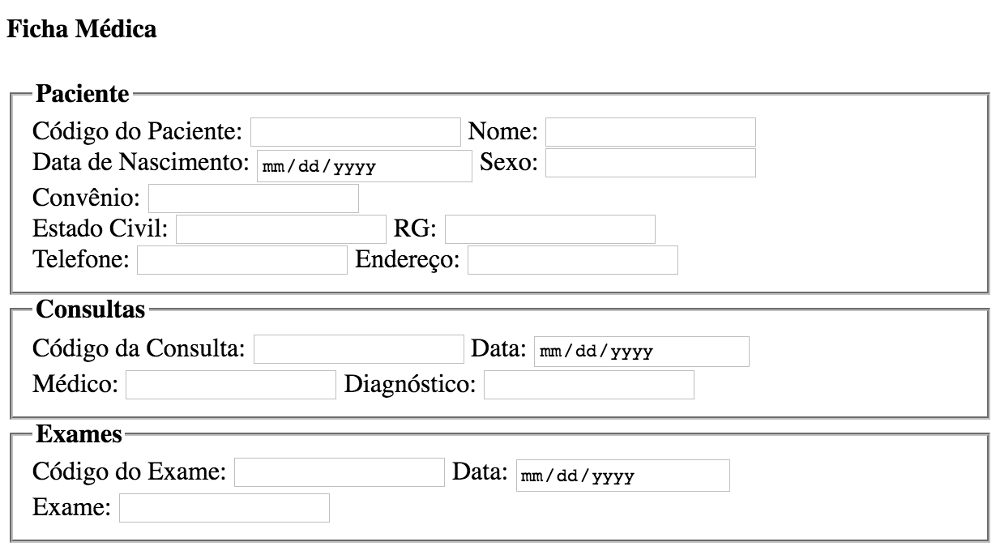

## Banco de Dados: Normalização

**Desenvolvimento de Aplicações Web - COLTEC/MG**

**João Eduardo Montandon**

### Formas Normais

Explique sucintamente cada uma das formas normais (1FN, 2FN e 3FN), e descreva um exemplo para cada uma.

### Ficha Médica

Com base no formulário abaixo, descreva a normalização passo a passo através de diagramas relacionais.

